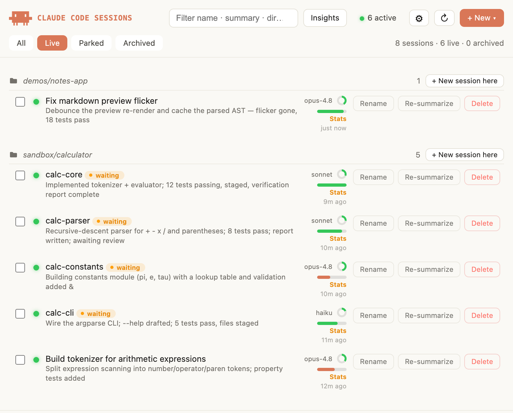
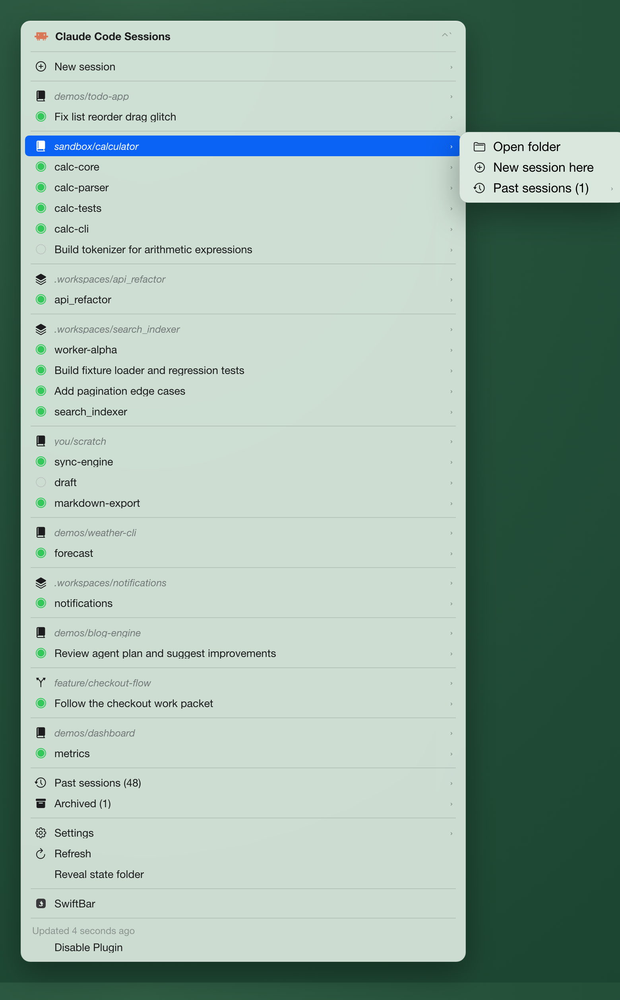

# Claude Code Sessions

A macOS menu-bar app for your **Claude Code** sessions, via [SwiftBar](https://swiftbar.app). It
lists every session Claude has on disk, shows which are **live** in iTerm **or** Terminal, and on
click **jumps** to the running tab/window or **revives** it with `claude --resume`. **Rename** a
session and the name sticks to it everywhere; if your terminal crashes or you quit it, **Restore**
reopens the whole last set — same app, same windows, same tab order. It also opens a webview
**panel** with AI one-line summaries, context-usage, status, search, and a per-session stats page.

## What you get

**Panel** (the first menu item) — Live / Parked / Archived tabs and a search that highlights
matches across name, summary, and directory. Each row shows a Claude-written summary, a status
bar, a context-usage ring, the model, and a "waiting on you" pill when it's your turn. Click a
row to jump/revive; click the ring for a **Stats** page (turns, tokens, cache, tool-uses). An
**Insights** button opens — or triggers — Claude Code's own `/insights` report.

<p align="center">
  
</p>

**Menu** — sessions grouped by directory with green/grey live dots; per session: Jump / Revive,
Rename, Archive, New-session-here, and a remap tool for directories you've moved or renamed.

<p align="center">
  
</p>

**Restore** — *iTerm or Terminal crashed?* **Restore** reopens your last open set in one click: every
session resumed with `claude --resume`, back in the app it was in, regrouped into the same windows,
in tab order, at their original size — each one `cd`'d back to its directory. Sessions already open
are skipped. The snapshot is only taken while something is live, so **quitting or crashing never
wipes it** — it's still there waiting for you.

**Rename** — a session's name comes from its transcript: your `/rename` title wins, otherwise
Claude's auto-title. **Rename** runs `/rename` in the live tab, so the new name *sticks with the
session* and shows up everywhere — menu, panel, and search. Once you're juggling a dozen sessions,
naming the ones you care about is what turns the list into something you can navigate. (Rename needs
a live tab — revive it first.)

## Install

**Prerequisites — install these yourself first:** macOS, [SwiftBar](https://swiftbar.app)
(`brew install --cask swiftbar`), a terminal — [iTerm2](https://iterm2.com) or the built-in
**Terminal.app** — the `claude` CLI, and `python3` (ships with macOS). Then run:

```sh
curl -fsSL https://raw.githubusercontent.com/spacegrowth/claude-sessions-swiftbar/main/install.sh | bash
```

The script **only installs the plugin** — it downloads the files into SwiftBar's plugin folder and
reloads SwiftBar. It does **not** install SwiftBar, a terminal, or `claude` (it just warns if SwiftBar
is missing). Re-run any time to update.

## Uninstall

```sh
curl -fsSL https://raw.githubusercontent.com/spacegrowth/claude-sessions-swiftbar/main/uninstall.sh | bash
```

Removes the plugin and stops its webview server, but **keeps** your state at `~/.ccsessions`
(archived flags, prefs). To delete that too, append `-s -- --purge`:

```sh
curl -fsSL https://raw.githubusercontent.com/spacegrowth/claude-sessions-swiftbar/main/uninstall.sh | bash -s -- --purge
```

## How it works

Reads `~/.claude/projects/*/*.jsonl` **read-only**: the filename UUID *is* the session id, so
revive resumes the exact conversation. Liveness is detected across **both** iTerm (by tab title)
and Terminal.app (by each tab's running process), so a session lights up — and Jump goes to — the
right app either way. Choose which terminal opens new/revived sessions (and tab vs window) in the
panel's ⚙ **Settings**. The only thing written back is an archived flag in `~/.ccsessions/`.
Summaries are generated with `claude -p` (Haiku) and refreshed only when a session changes.
